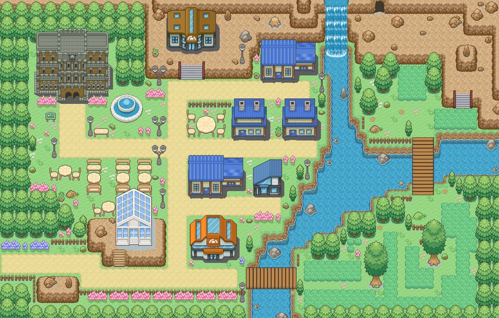
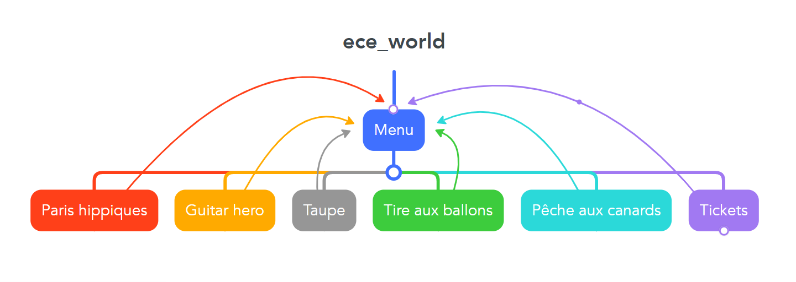
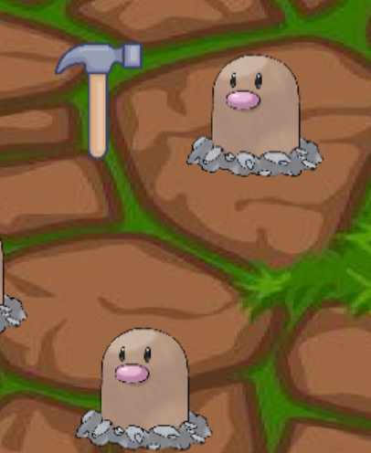
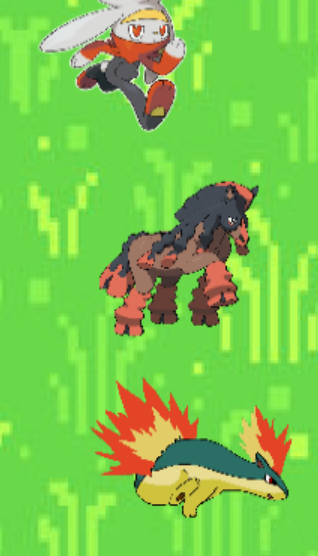
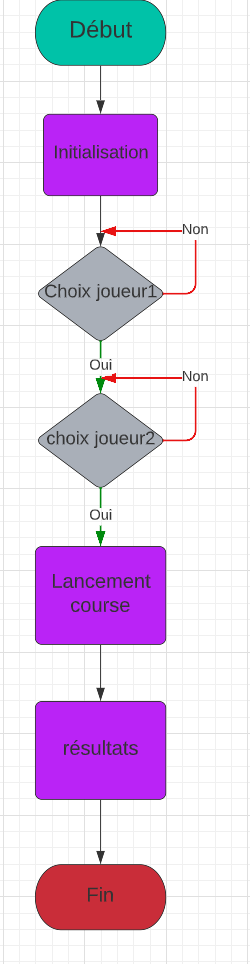
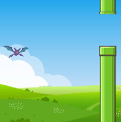

<!--
# Style lead only for this slide
_class: lead
_footer: Algorithmique Avancée et Bibliothèque Graphique - 2022-2023
-->

# ECE World

---

# Equipe Q

- Maxime Foucher
- Paul Carère
- Victorien Astie
- Augustin Zuffo
- Jean-Baptiste Markus

# **Carte**
*Réalisée par : Maxime.*

---

# Déroulement d'une partie
-Chaque joueur commence la partie avec 0 pokeball 
-Les joueurs choisissent à tour de rôle un mini-jeu 
-Les deux joueurs jouent au jeu choisi 
-Chaque mini jeu fait gagner ou perdre des pokeballs 
-La partie s'arrête quand un joueur ne possède plus de pokeball 

---

# Organisation des jeux

Nous avons créée un point c/h par mini-jeu.

Les paramètres les plus récurrents, qui sont pris par les jeux sont la queue d'évenements, les caractéristiques des deux joueurs(positions, scores, la map).
Les scores sont affichés à chaque fin de mini-jeu.

---
## Manège.c/h
Fichier qui comprend l'affichage de l'accueil du jeu avec la possibilité d'effectuer une sauvegarde.
Le fichier comprend les déplacements des deux joueurs.
C'est ici que sont chargés tous les `#include` et la taille de l'écran.

### Structure
Structure `personnage`qui contient les coordonnées des joueurs, leurs noms, si c'est leur tour de jouer et leur nombre de pokeballs ainsi que leur score.

---
# Le Fonctionnement

---

# Pêche aux canards, Tire aux ballons, Taupes

**Réalisé par : Maxime, Victorien, Jean-Baptiste**

Le fonctionnement de ces 3 jeux est le même pour les taupes, les canards et les pokeballs(ballons).Le jeu s'arrête quand le chronomètre est arrivé à 0 ou que toutes les cibles ont été touchées.

---

# Pêche aux canards, Tire aux ballons, Taupes

### Organigramme

---
# Pêche aux canards, Tire aux ballons, Taupes

### Structures

contiennent les coordonnées des cibles, leur état en booléen

### Tableaux

`CANARD tabcanard[NbCanard];`
`Cercle cercles[NUM_CERCLES];`
`TAUPE tabtaupe[NbTaupe];`

---

# Spécificités Pêche aux canards

`ALLEGRO_EVENT_MOUSE_AXES`
Déplacement du psykokwak en fonction de la position de la souris.

---
# Spécificités Tire aux ballons

**1**° Faire en sorte que les ballons rebondissent sur les parois du chapiteau.
`cercles[i].dx *= -1;`
`cercles[i].dy *= -1;`

**2**°Savoir quand une pokeball est cliquée?

---

# Paris Hippiques

**Réalisé par Paul**

Course de pokemons où les deux joueurs parient sur la même course.
La vitesse des pokemons est aléatoire et change dans le temps. Le classement de la course est affiché à la fin.

---
# Paris Hippiques

### Structures
La structure contient les coordonnées de chaque pokemon, chaque vitesse et un tableau de caractères pour le nom des pokemons.

### Structures

`Pokemon *tab[5] = {p1,p2,p3,p4,p5};`

---
# Paris Hippiques
### Algorigramme

---
# Guitare HERO

**Réalisé par : Augustin**

Les notes descendent le long de 4 cordes. Les notes apparaissent aléatoirement. Le joueur doit cliquer sur la touche associée à la corde pour pouvoir marquer des points.

---
# Guitare Hero
### Structures
Il y a 1 structure, pour les 4 cordes de la guitare , qui contiennent la position des notes, leurs vitesses et si elles sont actives.

### Tableaux
4 tableaux, pour les 4 cordes, de 20 notes

`Note notes[NB_MAX_NOTES];`
`Note notes2[NB_MAX_NOTES2];`
`Note notes3[NB_MAX_NOTES3];`
`Note notes4[NB_MAX_NOTES4];`

---
# Guitare Hero
### Algorigramme

---
# Flappy
**Réalisé par : Paul**
Le but est de passer entre des tuyaux. Si le pokemon rentre en collision avec un tuyau, le sol ou le plafond, le tour s'arrête. A chaque passage de tuyau le joueur obtient 1 point. La vitesse d'apparition des tuyaux augmente avec le temps.

---
# Flappy

### Structures

2 structures qui contiennent la Hit-box des tuyaux et du pokemon.

---

# Bilan collectif
## Ce qui aurait pu être amélioré
*  amélioration des jeux (affichage graphique, fluidité).
*  Les `al_rest` pour afficher les messages aux joueurs sont  à éviter.
* Nous aurions pu faire la saisie du nom des joueurs dans la fenêtre de jeu.
## Les points positifs
* Des réunions dès le départ pour la répartition du travail
* Une bonne entraide.

---

<!--
_class: lead
-->

# Les slides suivantes ne seront pas présentées oralement lors de la soutenance mais doivent figurer dans la présentation. Nous les survolerons rapidement.

---

# Jean-Baptiste

- `✅ 100%` Tire aux ballons

- `20%` snake. Le snake n'a jamais vu le jours.

---
# Maxime

- `✅ 100%` La map et les déplacements
- `✅ 100%` La pêche aux canards

---
# Paul

- `✅ 100%` Paris Hippiques
- `✅ 100%` flappy Bird

---
# Victorien

- `✅ 100%` Taupes
  L'animation de l'apparition des taupes aurait pu être améliorée
---
# Augustin
- `✅ 90%` Guitar HERO
  Complexité de la superposition entre l'apparition des notes et la musique.
  2 ème joueur.

---
# Investissement

Si nous devions nous attribuer les points, nous regarderions la difficulté du code que chacun a fait. Puis nous regarderions la quantité de travail fournit par chacun. En fonction de ces paramètres nous determinerions les notes.

---

# Récapitulatif des jeux

| Jeu | Avancement | Problèmes / reste |
| --- | --- | --- |
| Pêche aux canards | 100% | Ajout d’un circuit de canards circulaire sur l’écran tournant en boucle et ajout de vitesses variables entre les canards . Aucun problème sur le jeux. |
| Tir aux ballons | 100% | - |
| Guitar Hero | 90% | Ajout d’un circuit de touches en accord avec la musique et pas de deuxième joueur.  |

---
| Jeu | Avancement | Problèmes / reste |
| --- | --- | --- |
| Taupe-là | 100% | Ajout d’une animation sur l’apparition des taupes et rotation du marteau (avec un système de statut UP et DOWN. Aucun problème sur le jeux).  |
| Paris hippiques | 100 % | Ajout d’une meilleure animation des chevaux et l’ajout de manches. Aucun problème sur le jeux. |
| Flappy bird | 100 % | Ajout d’une difficulté avec la diminution crescendo de l’espacement entre les 2 tuyaux. Aucun problème sur le jeux. |

---

<!--
_class: lead
-->
# Quelques éléments que vous pouvez utiliser à votre guise dans votre présentation

---

# Export PDF

Depuis récemment, l'export (**`Export Slide Deck...`**) en PDF oublie parfois des éléments.
Si c'est le cas, nous vous conseillons d'exporter en fichier PowerPoint (pptx), puis de l'exporter en PDF depuis PowerPoint.

---
